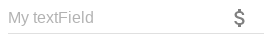

#### INFO: This package is useful for material-ui 0.x, You don't need it if you use material-ui v1.x !

# material-ui-textfield-icon

This package provide a TextFieldIcon for [Material-UI][mui].
Use the storybook inside for test.



## Installation
```shell
npm i material-ui-textfield-icon --save
```

## Usage

```jsx
import TextFieldIcon from 'material-ui-textfield-icon';

<TextFieldIcon
  hintText='My textField'
  icon={<HelpOutline />}
  fullWidth={false}
/>
```

## Properties
| Name | Type | Default | Description |
| --- | --- | --- | --- |
| icon* | `node` | | The`Icon` you want to display |
| iconPosition | `string` | after | A string use for the icon position. 'after' OR 'before' |
| iconProps | `object` | {} | An object of IconButton material-ui props |
| textFieldStyle | `object` | {} | An object of material-ui textField styles |
| iconStyle | `object` | {} | An object of material-ui IconButton styles |

\* required property

## License
The files included in this repository are licensed under the MIT license.

[mui]: http://www.material-ui.com/#/
